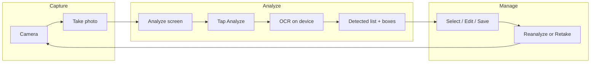
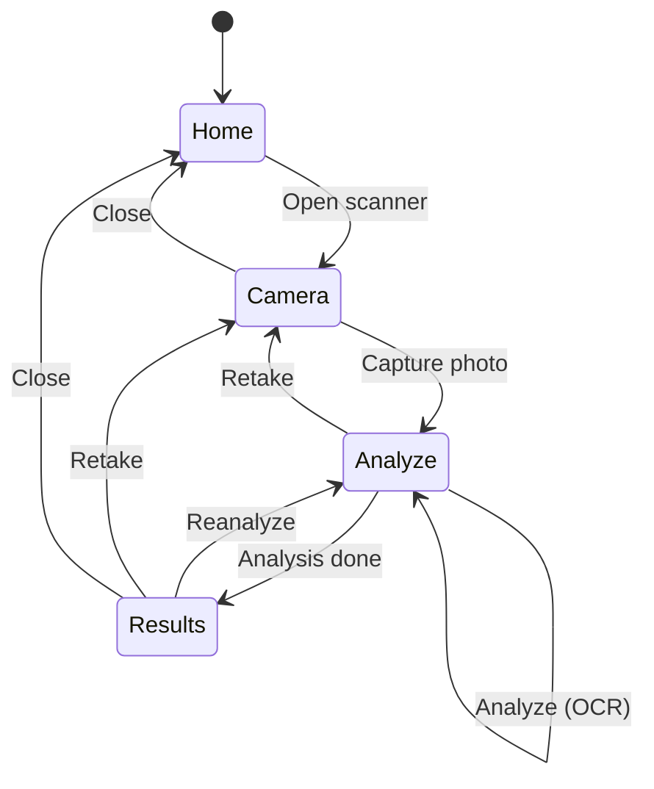
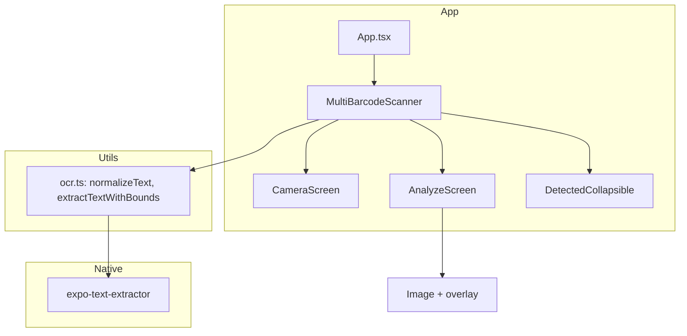

# CodeScan

A React Native (Expo) app that captures a photo and uses **on-device OCR** to extract and collect text—ideal for serial numbers, codes, or any printed text you want to capture in bulk without typing.

---

## What is this app for?

CodeScan lets you:

1. **Take a photo** of a document, label sheet, or list (e.g. serial numbers under barcodes).
2. **Run OCR** on the image to detect text.
3. **Review and select** which detected lines to keep (with optional bounding boxes on the image).
4. **Save** selected items into a list and **reanalyze** or **retake** as needed.

Use it when you need to quickly digitize printed text (inventory codes, serial numbers, part numbers, etc.) without manual entry. All processing runs on the device; no image is sent to a server.

---

## Why use it?

| Need | How CodeScan helps |
|------|---------------------|
| Capture many codes from a printed list | One photo → OCR extracts text → select and save in one session |
| Avoid retyping serial numbers | Point the camera, tap Analyze, then Save the lines you need |
| Keep data on device | OCR runs locally (ML Kit / Vision); no cloud upload required |
| Correct or trim bad reads | Edit any detected line (long-press), or clear and reanalyze |

---

## How it works

High-level flow:



**Screen flow:**



**Tech flow:**

- **Camera** → `expo-camera` captures a photo.
- **Analyze screen** → Shows the image; you tap **Analyze**.
- **OCR** → `expo-text-extractor` (Apple Vision on iOS, ML Kit on Android) returns text (and optional bounding boxes).
- **Filtering** → Short lines and common labels (e.g. “No.”, “Serial Number”) are skipped so the list focuses on actual codes.
- **Deduplication** → Normalized text is compared so the same value isn’t added twice.
- **List** → Detected lines appear in a bottom collapsible; you can select/deselect, edit (long-press), Save, Clear, or Reanalyze.

---

## Architecture (simplified)



- **MultiBarcodeScanner** – Orchestrates mode (camera vs analyze), capture, analyze, and list state.
- **CameraScreen** – Camera view and pinch-to-zoom.
- **AnalyzeScreen** – Shows captured image, Analyze/Retake, and bounding box overlay when bounds are available.
- **DetectedCollapsible** – Bottom sheet with detected list, selection, Save, Reanalyze, and long-press edit.
- **ocr.ts** – Text normalization and optional `extractTextWithBounds()` (uses native API when present).

---

## Setup

### Prerequisites

- **Node.js** 20.19.4+ (e.g. `asdf set nodejs 20.19.4` or `.tool-versions` with `nodejs 20.19.4`).
- **iOS**: Xcode and CocoaPods (for `expo run:ios`).
- **Android**: Android Studio (or CLI tools) and `ANDROID_HOME` set (e.g. `~/Library/Android/sdk` on macOS).

### 1. Clone and install

```bash
git clone <repo-url>
cd coderscan
npm install --legacy-peer-deps
```

Use `--legacy-peer-deps` if you hit peer dependency warnings with Expo SDK 54.

### 2. Run with development client (recommended for OCR)

OCR uses native modules and **does not run in Expo Go**. Use a custom dev client:

**iOS:**

```bash
npx expo run:ios
```

**Android:**

```bash
npx expo run:android
```

Then start Metro for the dev client:

```bash
npx expo start --dev-client
```

Open the **CodeScan** dev client on the device/simulator; it will connect to this project.

### 3. (Optional) Run in Expo Go

```bash
npx expo start
```

Then scan the QR code with Expo Go. **OCR and bounding boxes will not work** in Expo Go; you’ll need the dev client for full functionality.

---

## Android SDK (if needed)

If you see **"Failed to resolve the Android SDK path"**:

1. Install [Android Studio](https://developer.android.com/studio) (or [command-line tools](https://developer.android.com/studio#command-tools)) and install the Android SDK.
2. Set `ANDROID_HOME` and add tools to `PATH`:

   ```bash
   export ANDROID_HOME=$HOME/Library/Android/sdk
   export PATH=$PATH:$ANDROID_HOME/emulator:$ANDROID_HOME/platform-tools
   ```

   Add these to `~/.zshrc` or `~/.bash_profile` to make them permanent.

---

## Stack

| Dependency | Purpose |
|------------|--------|
| **Expo SDK 54** | React Native tooling and runtime |
| **expo-camera** | Camera access and capture |
| **expo-text-extractor** | On-device OCR (Apple Vision / ML Kit) |
| **expo-dev-client** | Custom dev build for native OCR |
| **NativeWind v4** | Tailwind-style styling (`className`) |
| **expo-media-library** | Photo library permission (used from home screen) |

---

## Scripts

| Command | Description |
|---------|-------------|
| `npm start` | Start Expo dev server |
| `npm run ios` | Build and run on iOS (dev client) |
| `npm run android` | Build and run on Android (dev client) |
| `npm run web` | Run in browser (limited; no OCR) |

---

## Permissions

- **Camera** – Requested when you open the scanner; configured in `app.json` via the `expo-camera` plugin.
- **Photo library** – Requested from the home screen; configured via the `expo-media-library` plugin.

If access was denied, the app can prompt to open **Settings** so the user can enable the permission.

---

## Optional: Bounding box patch (expo-text-extractor)

The repo includes logic to show **bounding boxes** around detected text. Full support requires a native extension that returns bounds from OCR. If you’ve added that in a fork or patch of `expo-text-extractor`:

1. Install patch-package (if not already):  
   `npm i -D patch-package`
2. Add to `package.json` scripts:  
   `"postinstall": "patch-package"`
3. After editing `node_modules/expo-text-extractor`, save the patch:  
   `npx patch-package expo-text-extractor`

Without the bounds API, the app still works; only the on-image boxes are skipped.

---

## Optional: App icon and splash

To set a custom icon and splash in Expo:

1. Add under `assets/`:
   - `icon.png` (e.g. 1024×1024)
   - `splash-icon.png`
   - `adaptive-icon.png` (Android)
2. Reference them in `app.json` (see [Expo config](https://docs.expo.dev/develop/user-interface/splash-screen-and-app-icon/)).
